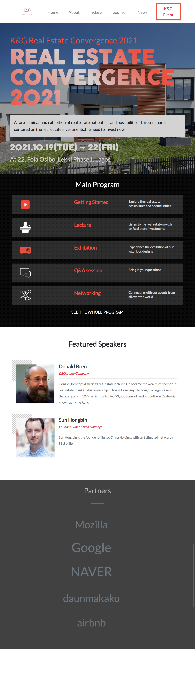

# Capstone Project

Behance conference page

This is a personalised Kas & Green Realtors seminar/conference page.
This project desinged is created with mobile first approach for responsiveness using bootstrap and css with good practice 

Screenshots:

Tablet Version :

Desktop Version :

## Built With 🔨

- HTML5
- -CSS
- Bootstrap
- Visual Studio Code
- Git & Github

## Live Demo 👀

[Live Demo Link](https://fortuneonyeka.github.io/capstone-project/)

### Install

To get a local copy up and running follow these simple example steps.
- Open terminal
- Clone this project by command git clone https://github.com/fortuneonyeka/capstone-project.git
- Cd news-week folder
- Open index.html in browser

## Getting Started 
- Index.html is the main marke up that will show as the first page in the browser .
- about.html is the second and about page
- tickets.html is the third and ticketing page
- You will find seperate css files for each of the pages
- img folder contains all the images and icons used in building this project

### Prerequisites

- IDE to edit and run the code (We've used Visual Studio Code 🔥).

### Usage

- For anyone who wants to practice HTML5,css and Bootstrap responsive design.
- How to apply responsive desing using Bootstrap,media query and good practices.

## Author

👤 **Ihedoro Fortunatus Onyeka**

- GitHub:[@hfortuneonyeka](https://github.com/fortuneonyeka)
- Twitter: [@fortuneonyeka](https://twitter.com/FortuneOnyeka)
- LinkedIn: [Fortunatus Ihedoro](https://www.linkedin.com/in/fortunatus-ihedoro-5a43711a3/)

## 🤝 Contributing

Contributions, issues, and feature requests are welcome!

Feel free to check the [issues page]().

## Show your support

Give a ⭐️ if you like this project!

## Acknowledgments

- Inspiration
- Microverse program 
- My standup team 

## License
This project is [MIT](./mit.md) licensed.
